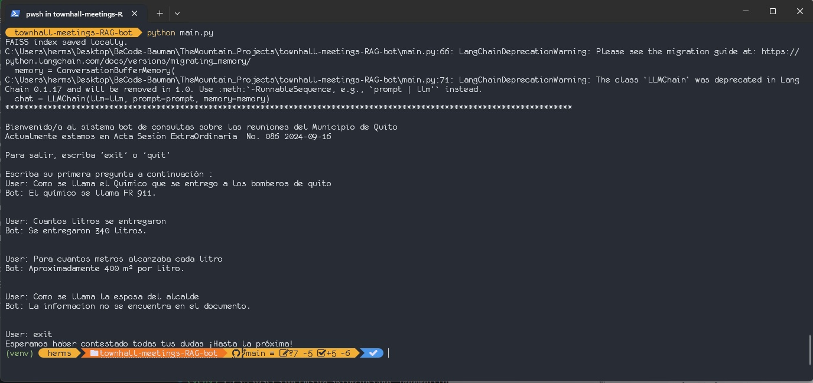

# RAG Bot for Town Hall Meeting Records

## Project Overview

### Description

The project is a proof of concept to introduce a new bot feature for the Civic Tech App project.
It implements a mini-RAG and a bot to ask questions about one specific document. The documents are the pdfs used in the [Civic Tech App Project](https://github.com/hermstefanny/cv-tech-app-fe/) for [summarization with GPT4-o-mini](https://github.com/hermstefanny/preprocessing/blob/master/pipeline_integrated_zero-zhot.ipynb)

## Problem Statement

According to feedback received when the evaluation of the Civic Tech App project was conducted, a more granularity of detail was deemed necessary in the summaries of the Town Hall Record Meetings.
To achieve this goal, a GPT-model-based bot with simple RAG implementation is proposed, being the present project a proof of concept and a first MVP to test technologies and evaluate performance.

## Objectives:

- Extract text from the pdf documents
- Create embedded vectors for RAG processing with `OpenAIEmbeddings` library
- Save embeddings with `FAISS`
- Implement RAG pipeline
- Implement a chatbot with a `OpenAI` GPT model

**IMPORTANT**:

```
 The queries and the prompts are in Spanish, this is to be in accordance to the language of the documents.
```

## Requirements and Tools

### Languages

- Python 3.10

### Libraries

- `pymupdf`
- `langchain`
  - `langchain_openai`
  - `langchain_community`

### Requirements

- Others listed in `requirements.txt`

## Module description

### `text_extraction.py`

Implements the functionality for extracting text from the pdfs, including managing the paths directory

### `embedding.py`

Manages the creation of the vectors embeddings with `text-embedding-3-small` from `OpenAI` and the saving of the `FAISS` index

### `main.py`

- Extracts the text form the pdf (At this stage, just one document is being tested)
- Implements the RAG pipeline

  - Create chunks of text
  - Create embeddings of these chunks
  - Create the object `retriever` with a determined number of chunks

  - Implements the bot functinality
    - Establishes a `llm`, `ChatPromptTemplate` and a `ConversationBufferMemory` objects
    - Send these objects as arguments to `LLMChain`object to create the chat
    - Implements a loop that will interact with the user

## Usage

- Clone the repository
- Create a virtual environment with and install the dependencies in `requirements.txt`
- Run the program with `python main.py`
- Chat with the bot

## RESULTS & CHALLENGES

### Results

#### Usage example



- The RAG pipeline implemented with `langchain` and `OpenAI` libraries integrates seamessly with the `OpenAI` model for chatbot functionalities
- `gpt-5-nano` performs slightly worse than `gpt-4-o-mini`
- The chatbot still has problems with language variation and hallucinations

### Challenges

- Some `langchain` functionalities appear to be deprecated, which means that a migration is necessary for long-term deployment.
- The FAISS files are generated everytime the program is run, which is not necessary

## Future Work

- Refactoring and code organization for better modularity
- Code migration to avoid obsolescence
- Further experimentation with chunks to analize, chunk size and variation is necessary, even dynamic sizing, to adapt to the documents unique qualities
- FAISS library works well for a proof of concetp, but for integration with the [Civic Tech App Project](https://github.com/hermstefanny/cv-tech-app-fe/), a different data storage option is necessary
